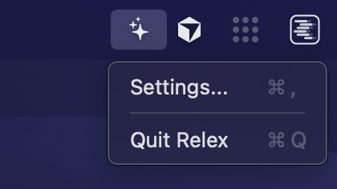
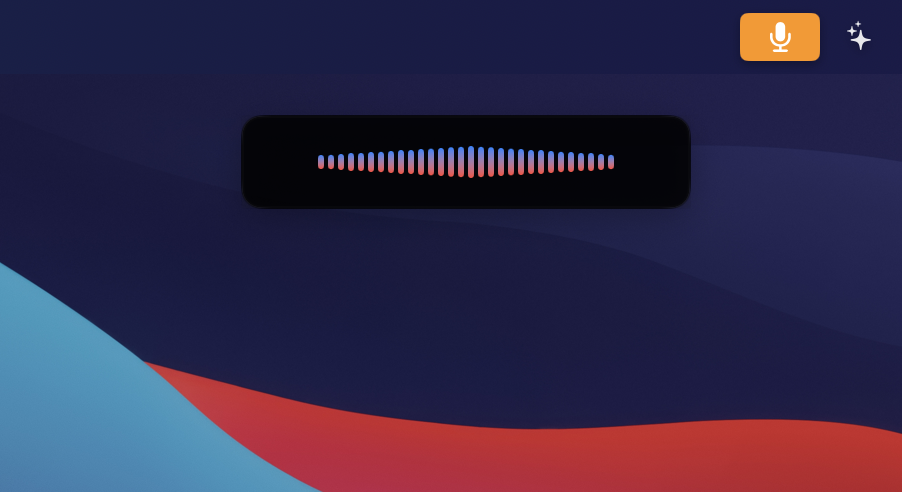
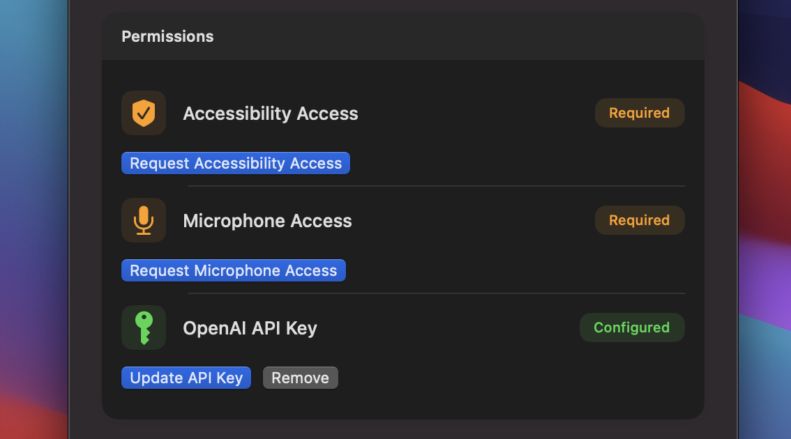
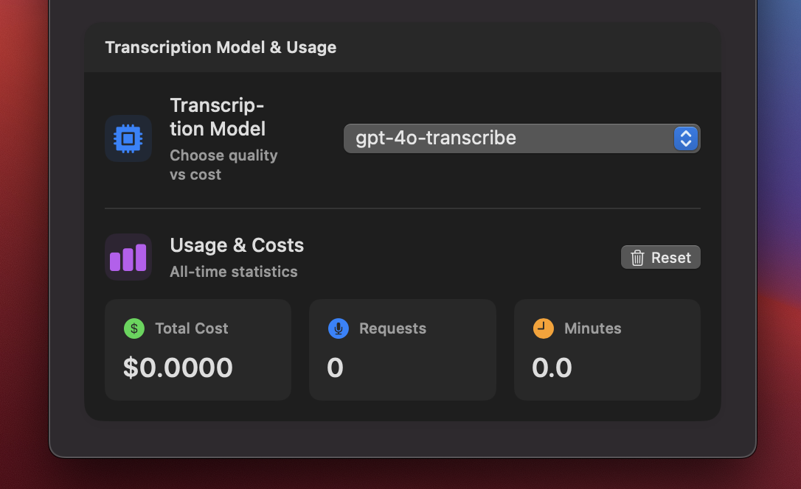

<div align="center">
  

  # Relex

  **Open Source Voice Dictation & AI Text Editor**

  Voice dictation and AI-powered text editing for macOS - hold Right Option to dictate or transform selected text with voice commands.

  💻 Fully open source • 🔒 Your data stays private • 💰 Pay only for what you use • 🤖 GPT-powered text transformation
</div>

## Features

### Voice Dictation
- 🌍 **Works Everywhere**: Use in any app - Chrome, Slack, Notes, Terminal, anywhere you can type
- 🎤 **Accurate Transcription**: Powered by OpenAI's GPT-4o transcription for high-quality speech-to-text
- ⚡ **Simple & Fast**: Hold Right Option to record, release to transcribe
- 🎯 **Smart Text Insertion**: Automatically inserts transcribed text at your cursor position
- 🎨 **Visual Feedback**: Purple-to-blue gradient indicates dictation mode

### AI Text Editing
- ✨ **Voice-Commanded Text Transformation**: Select text and use voice commands to transform it
- 🤖 **GPT-Powered**: Uses GPT-4o or GPT-4o-mini to intelligently edit your text
- 🔄 **Smart Context Awareness**: Preserves formatting, line breaks, and text structure
- 🎨 **Visual Distinction**: Red-to-yellow gradient indicates command mode
- 💬 **Natural Commands**: Say things like "make this more formal", "fix grammar", or "simplify this"

### General
- 📊 **Usage Tracking**: Monitor both transcription and GPT API costs separately
- 🔒 **Privacy-Focused**: Runs as a menu bar app with secure API key storage in Keychain
- ⌨️ **Cancellable**: Press Escape at any time to cancel operation

## Screenshots

### Menu Bar Integration



Access Relex from the menu bar with quick access to settings and quit options.

### Voice Recording Overlay



The voice recording overlay appears near your cursor when you hold the Right Option key:

- Real-time waveform visualization during recording
- Pulsing dots animation during transcription
- Non-intrusive design that doesn't steal focus
- Cancellable at any time with Escape key

### Settings Window

#### How to Use


Quick reference guide showing keyboard shortcuts and usage instructions.

#### Permissions



Manage required permissions for accessibility and microphone access, plus configure your OpenAI API key.

#### Models & Usage Statistics



Select your preferred AI models (GPT-4o transcription and GPT chat models) and monitor separate usage statistics for both transcription and text transformation commands in real-time.

## Requirements

- macOS 15.6 or later
- Xcode 26.0 or later (for building from source)
- OpenAI API key for GPT-4o transcription
- Microphone access permission
- Accessibility access permission

## Installation

1. **Download** the latest release from [GitHub Releases](https://github.com/TheoDepr/Relex/releases)
2. **Unzip** `Relex.app.zip`
3. **Move** `Relex.app` to your Applications folder
4. **Launch** Relex (right-click and select "Open" the first time to bypass Gatekeeper)
5. Look for the **star icon** in your menu bar

### Building from Source (Optional)

If you prefer to build from source:

```bash
git clone https://github.com/TheoDepr/Relex.git
cd Relex
open Relex.xcodeproj
# Build and run with ⌘R in Xcode
```

## Detailed Setup

1. **Launch Relex**:
   - After building and running, Relex appears as a menu bar app (star icon in top-right corner)
   - Click the star icon to access Settings

2. **Grant Permissions**:
   - **Accessibility Access**: Click "Request Accessibility Access" in Settings
     - Opens System Settings → Privacy & Security → Accessibility
     - Enable Relex in the list
     - Required for hotkey monitoring and text insertion
   - **Microphone Access**: Click "Request Microphone Access" in Settings
     - Required for voice recording

3. **Configure OpenAI API Key**:
   - Click "Configure API Key" in Settings
   - Enter your OpenAI API key (get one at <https://platform.openai.com/api-keys>)
   - The key is stored securely in your system's Keychain

4. **Select Models** (Optional):
   - **Transcription Model** - Choose between GPT-4o transcription models:
     - `gpt-4o-mini-transcribe`: 50% cheaper at $0.003/min
     - `gpt-4o-transcribe`: Standard quality at $0.006/min
     - `gpt-4o-transcribe-diarize`: Speaker identification at $0.006/min
   - **GPT Model** - Choose for text transformation commands:
     - `gpt-4o-mini`: Fast & cheap at ~$0.001 per command
     - `gpt-4o`: Higher quality at ~$0.01 per command

## Usage

Relex has two modes that automatically activate based on whether you have text selected:

### Voice Dictation Mode (No Text Selected)

Use this mode to insert new text via voice:

1. **Click in a text field** (don't select any text)
2. **Hold Right Option** key
   - Overlay appears with **purple-to-blue** waveform
3. **Speak your text** clearly
4. **Release Right Option**
   - Audio transcribed via GPT-4o transcription
   - Text automatically inserted at cursor
5. **Press Escape** to cancel anytime

**Example:** Click in a document, hold Right Option, say "Hello world", release → "Hello world" appears

### AI Text Editing Mode (Text Selected)

Use this mode to transform existing text with voice commands:

1. **Select/highlight text** you want to transform
2. **Hold Right Option** key
   - Overlay appears with **red-to-yellow** waveform (indicates command mode)
3. **Say a command** like:
   - "make this more formal"
   - "fix the grammar"
   - "simplify this"
   - "make it shorter"
   - "rewrite this in a friendly tone"
4. **Release Right Option**
   - Voice transcribed to command
   - GPT processes selected text + command
   - Selected text replaced with result
5. **Press Escape** to cancel anytime

**Example:** Select "the cat sat on mat", hold Right Option, say "fix grammar", release → "The cat sat on the mat."

### How It Works

**Dictation Mode (No Selection):**
1. Hold Right Option → Recording starts (purple-to-blue overlay)
2. Release Right Option → GPT-4o transcribes audio
3. Text inserted at cursor position

**Command Mode (Text Selected):**
1. Select text → Hold Right Option → Recording starts (red-to-yellow overlay)
2. Release Right Option → GPT-4o transcribes voice command
3. GPT-4o processes: selected text + command → transformation
4. Original text replaced with GPT result

**Text Insertion Methods:**
- **Native macOS Apps**: Accessibility APIs for instant insertion
- **Web Browsers**: Clipboard paste simulation for compatibility

### Usage Tracking

View separate statistics for each API in Settings:

**Transcription Usage (GPT-4o Transcription):**
- Total cost, number of requests, minutes transcribed
- Per-model breakdown

**GPT Usage (Text Commands):**
- Total cost, number of commands, tokens used
- Per-model breakdown

Reset all statistics anytime with the Reset button

## Keyboard Shortcuts

### Voice Operations

- **Hold Right Option**: Start voice recording
  - No text selected → Dictation mode (purple-to-blue overlay)
  - Text selected → Command mode (red-to-yellow overlay)
- **Release Right Option**: Stop recording and process
  - Dictation mode → Transcribe and insert text
  - Command mode → Transcribe command and transform selected text
- **Escape**: Cancel operation at any time (recording, transcribing, or processing)

### Menu Bar

- **⌘,** (Command-Comma): Open Settings window
- **⌘Q** (Command-Q): Quit Relex

## Privacy & Security

Relex is designed with security and privacy as top priorities, making it safe for individual and enterprise use:

### Data Privacy
- **100% Open Source**: All code is publicly available for security audits and review
- **No Data Collection**: Relex does not collect, store, or transmit any user data, analytics, or telemetry
- **No Third-Party Tracking**: No analytics services, crash reporters, or tracking SDKs
- **Local Processing**: All audio recording happens entirely on your Mac
- **Direct API Communication**: Audio is sent directly from your machine to OpenAI's API - no intermediary servers
- **Temporary Files Only**: Audio files are created temporarily and deleted immediately after transcription

### Secure Credential Storage
- **macOS Keychain Integration**: Your OpenAI API key is stored using Apple's Keychain Services
- **Device-Only Access**: Uses `kSecAttrAccessibleWhenUnlockedThisDeviceOnly` - keys never leave your device
- **No Cloud Sync**: API keys are not synced via iCloud or any cloud service
- **Encrypted Storage**: Leverages macOS's secure enclave for encryption

### Minimal Permissions
- **Accessibility Permission**: Only required for:
  - Monitoring Right Option and Escape key presses
  - Inserting transcribed text at cursor position
  - No screen recording or keyboard logging beyond these specific functions
- **Microphone Access**: Only active when you hold the Right Option key
  - No background recording
  - Visual indicator (overlay) always shows when microphone is active

### OpenAI API Usage
- **Your Own API Key**: You control your OpenAI account and can review all API usage
- **Two API Services**:
  - GPT-4o Transcription API for voice-to-text (dictation mode)
  - GPT-4o Chat API for text transformation (command mode)
- **Direct Billing**: You pay OpenAI directly - no markup or hidden fees
- **Usage Transparency**: Built-in cost tracking shows exactly what you're spending for each service
- **Standard OpenAI Terms**: Subject to [OpenAI's API Terms](https://openai.com/policies/terms-of-use) and [Privacy Policy](https://openai.com/policies/privacy-policy)

### Compliance & Auditing
- **Fully Auditable**: Open source codebase allows security teams to review all functionality
- **No Network Dependencies**: Only communicates with OpenAI's API - no other network requests
- **Reproducible Builds**: Build from source to verify the exact code running on your machine
- **MIT License**: Permissive licensing allows modification and internal deployment

## License

MIT License

## Contributing

Contributions are welcome! Please feel free to submit issues or pull requests.

## Credits

Built with Swift, SwiftUI, and OpenAI's GPT-4o API for transcription and intelligent text transformation.
